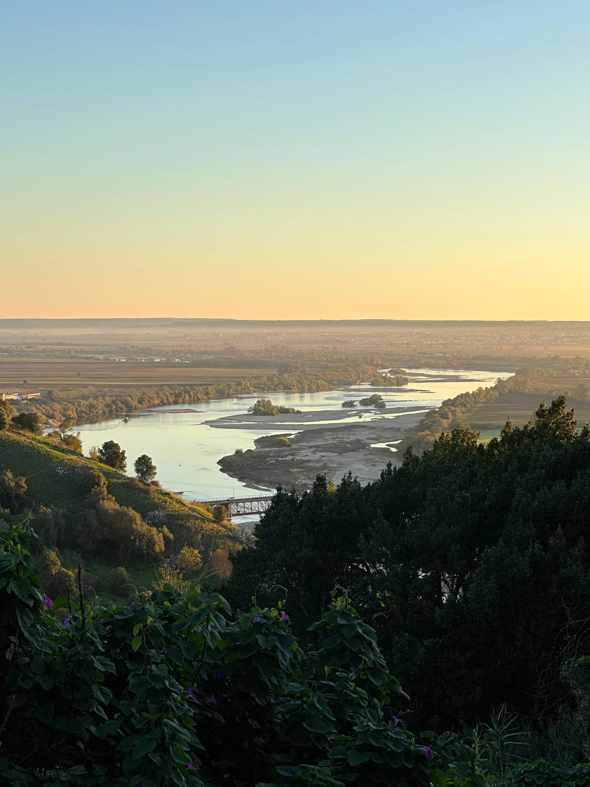

```{=html}
<a class="skip-link" href="#main">Skip to content</a>
<main id="main">
```

:::::: {.gw-page .gw-section .gw-section--tight}
```{=html}
<p class="gw-eyebrow">Chapter 1 · Interconnected Surface Water</p>
```

<div class="gw-chapter-head gw-chapter-head--isw">



```{=html}
<h1 class="gw-chapter-title">How does a pumping impact become a management decision?</h1>
</div>
```

::::: gw-chapter-intro
:::: gw-chapter-intro__body
::: gw-prose
Interconnected surface water is one of the biggest challenges for
accounting under SGMA. Pumping groundwater affects depletion of a
stream, either by drawing water from the surface water directly or
intercepting the water that would feed into the stream. The effects are
usually lagged and highly dependent on the material and properties of
the aquifer system, which are usually inferred rather than observed.

Tracking this phenomenon and turning it into compliance takes a chain of
steps — the most important link being where measurement stops and
accounting begins.

All  subbasins run numerical
groundwater–surface water models, and all three produce a depletion
figure attributable to pumping. However, in each case the compliance
loop is connected to a groundwater-level proxy and not the depletion
figure.
:::
::::

```{=html}
<figure class="chapter-photo chapter-photo--water">
  <div class="chapter-photo__frame">
    
  </div>
  <figcaption class="chapter-photo__cap">
    <span class="chapter-photo__cap-rule" aria-hidden="true"></span>
    <span class="chapter-photo__cap-label">Interconnected Surface Water</span>
  </figcaption>
</figure>
```
:::::
::::::

:::: {.gw-band}
::: gw-wide
```{=html}
<h2 class="gw-eyebrow">1.1 The Accounting Lifecycle</h2>
<p class="isw-lede">Scroll to see how the accounting chain operates for interconnected surface water — and where that chain breaks down.</p>

<section class="isw-scrolly" aria-label="The interconnected surface water accounting chain, step by step">
  <div class="isw-stage">
    <div class="isw-scene">
      <div class="isw-figure-col">
        <figure class="gw-figure isw-figwrap">
          <p id="isw-plate-summary" class="gw-sr-summary">
            A shallow cutaway of a stream and the ground beneath it. A thick band
            of vegetation sits over a thicker band of brown sediment; below them
            is one continuous saturated aquifer. The boundary between the brown
            sediment and the blue aquifer is the water table. A broad, shallow
            stream sits in a low bowl on the left, and the water table meets it,
            so shallow groundwater and the stream are one connected system. A
            wide monitoring well stands beside the stream; a wider, deeper
            pumping well stands away from it. Pumping pulls the water table down
            into a cone of depression around the pumping well and reduces the
            groundwater that would otherwise reach the stream; the gap from the
            pre-pumping water table is the stream depletion attributable to
            pumping. A numerical model produces that depletion volume, but the
            compliance test is run instead on measured groundwater elevation at
            the monitoring well — a proxy — checked against a threshold. That
            substitution, from modelled depletion to groundwater-level proxy, is
            where the chain breaks. Steps one and two are the physical response;
            the rest are the accounting chain.
          </p>

          <svg class="isw-svg" viewBox="0 0 648 430" role="img" aria-labelledby="isw-fig-title isw-plate-summary" xmlns="http://www.w3.org/2000/svg">
            <title id="isw-fig-title">Cutaway of pumping, the water table, and stream depletion</title>
            <defs>
              <clipPath id="isw-sect"><path d="M0 114 Q 34 109 66 113 Q 100 119 132 112 Q 146 109 156 100 Q 178 74 204 62 Q 270 54 350 57 Q 440 61 524 54 Q 582 50 624 55 L640 43 L640 414 L624 426 L0 426 Z"/></clipPath>
              <pattern id="isw-clast" width="50" height="42" patternUnits="userSpaceOnUse" patternTransform="rotate(5)">
                <path d="M9 11 q4 -5 8 -1 q3 4 -1 7 q-6 3 -9 -1 z" fill="#9c7a5552" />
                <path d="M30 5 q5 -2 7 3 q1 5 -4 7 q-6 0 -6 -5 z" fill="#89694650" />
                <path d="M41 25 q5 -1 6 4 q0 5 -5 6 q-5 -1 -5 -6 z" fill="#a8825b48" />
                <path d="M15 30 q4 -4 7 0 q3 4 -1 7 q-5 3 -8 -1 z" fill="#82623f52" />
                <circle cx="45" cy="10" r="2" fill="#9c7a5548" />
                <circle cx="4" cy="35" r="2.1" fill="#93714b44" />
                <circle cx="25" cy="33" r="1.5" fill="#a8825b40" />
              </pattern>
              <marker id="isw-ar" viewBox="0 0 10 10" refX="7" refY="5" markerWidth="6" markerHeight="6" orient="auto-start-reverse">
                <path d="M0 1 L8 5 L0 9 z" fill="#33454f" />
              </marker>
              <marker id="isw-arl" viewBox="0 0 10 10" refX="7" refY="5" markerWidth="5.5" markerHeight="5.5" orient="auto-start-reverse">
                <path d="M0 1 L8 5 L0 9 z" fill="#e3e9ec" />
              </marker>
              <marker id="isw-fb" viewBox="0 0 10 10" refX="6" refY="5" markerWidth="5" markerHeight="5" orient="auto-start-reverse">
                <path d="M0 1 L8 5 L0 9 z" fill="#6a6659" />
              </marker>
              <g id="isw-grass" fill="none" stroke-linecap="round">
                <path d="M0 0 Q -3 -11 -8 -18" stroke="#6f8a3c" stroke-width="1.8" />
                <path d="M0 0 Q 0 -12 -1 -21" stroke="#7d9846" stroke-width="1.8" />
                <path d="M0 0 Q 4 -11 9 -17" stroke="#6f8a3c" stroke-width="1.8" />
                <path d="M0 0 Q 7 -8 13 -12" stroke="#647c37" stroke-width="1.6" />
                <path d="M0 0 Q -6 -8 -12 -12" stroke="#647c37" stroke-width="1.6" />
              </g>
              <g id="isw-flower">
                <line x1="0" y1="1" x2="0" y2="10" stroke="#4a5c26" stroke-width="1.2" />
                <circle cx="0" cy="0" r="2.4" fill="#d8c667" />
                <circle cx="-2.6" cy="0" r="1.5" fill="#d8c667" />
                <circle cx="2.6" cy="0" r="1.5" fill="#d8c667" />
                <circle cx="0" cy="-2.6" r="1.5" fill="#d8c667" />
                <circle cx="0" cy="2.6" r="1.5" fill="#d8c667" />
                <circle cx="0" cy="0" r="1.1" fill="#b99a3f" />
              </g>
            </defs>

            <!-- ================= FIXED GEOLOGY — FRONT FACE ================= -->
            <g clip-path="url(#isw-sect)">
              <rect x="-4" y="38" width="656" height="392" fill="#5c7080" />
              <rect x="-4" y="38" width="656" height="392" fill="url(#isw-clast)" />
              <rect x="-4" y="52" width="656" height="244" fill="#5b3f28" />
              <rect x="-4" y="52" width="656" height="244" fill="url(#isw-clast)" />
              <!-- blue saturated aquifer; its TOP EDGE is the water table -->
              <path d="M-4 430 L-4 132 C 30 128 70 122 110 124 C 180 128 250 150 326 172 C 366 182 392 190 410 202 C 430 220 468 220 488 202 C 510 190 552 182 592 182 L624 192 L624 430 Z" fill="#5c7080" />
              <path d="M-4 430 L-4 132 C 30 128 70 122 110 124 C 180 128 250 150 326 172 C 366 182 392 190 410 202 C 430 220 468 220 488 202 C 510 190 552 182 592 182 L624 192 L624 430 Z" fill="url(#isw-clast)" />
              <!-- water-table / sediment-base line: one boundary, on the colour change -->
              <path d="M108 124 C 180 128 250 150 326 172 C 366 182 392 190 410 202 C 430 220 468 220 488 202 C 510 190 552 182 592 182 L624 192" fill="none" stroke="#39281880" stroke-width="1.7" />
              <!-- vegetation -->
              <path d="M150 100 Q 178 74 204 62 Q 270 54 350 57 Q 440 61 524 54 Q 582 50 624 55 L624 98 Q 500 96 360 98 Q 250 100 172 104 Q 158 105 150 100 Z" fill="#3f5020" />
              <path d="M150 100 Q 250 100 360 98 Q 500 96 624 98" fill="none" stroke="#26310fcc" stroke-width="1.6" />
            </g>

            <!-- ================= 2.5D DEPTH — RIGHT SIDE FACE ================= -->
            <path d="M624 55 L640 43 L640 414 L624 426 Z" fill="#4a5b68" />
            <path d="M624 55 L640 43 L640 414 L624 426 Z" fill="url(#isw-clast)" opacity="0.45" />
            <path d="M624 98 L640 86 L640 180 L624 192 Z" fill="#48311f" />
            <path d="M624 98 L640 86 L640 180 L624 192 Z" fill="url(#isw-clast)" opacity="0.45" />
            <path d="M624 55 L640 43 L640 86 L624 98 Z" fill="#313f19" />
            <path d="M470 52 L486 40 L640 43 L624 55 Z" fill="#43571f" />
            <path d="M624 55 L640 43" stroke="#242f0e" stroke-width="1.4" />
            <path d="M624 98 L640 86" stroke="#241810" stroke-width="1.4" />
            <path d="M624 192 L640 180" stroke="#2e3c46" stroke-width="1.4" />
            <path d="M624 55 L624 426" stroke="#2e2e22" stroke-width="1" opacity="0.28" />
            <path d="M624 426 L640 414" stroke="#2e3c46" stroke-width="1.4" />

            <!-- ================= MODEL DOMAIN (step 03) ================= -->
            <g class="fig-stage fig-stage--model">
              <rect x="-4" y="188" width="628" height="238" fill="#33697f" opacity="0.13" />
            </g>

            <!-- ================= SURFACE WATER (broad, shallow, left depth face) ================= -->
            <path d="M0 116 L6 112 L6 138 L0 143 Z" fill="#5e7686" />
            <path d="M6 112 Q 30 107 58 112 Q 90 118 120 111 Q 138 108 150 115 Q 150 129 137 137 Q 96 150 54 148 Q 24 146 8 135 Q 6 124 6 112 Z" fill="#7c96a8" />
            <path d="M10 132 Q 52 149 100 146 Q 132 144 148 130 Q 140 148 96 152 Q 48 154 16 141 Z" fill="#5e7686" opacity="0.5" />
            <path d="M6 112 Q 30 107 58 112 Q 90 118 120 111 Q 138 108 150 115" fill="none" stroke="#57707e" stroke-width="1.3" />
            <path d="M0 116 L6 112" stroke="#4c6270" stroke-width="1.1" />

            <!-- ================= VEGETATION DETAIL ================= -->
            <g class="isw-flora">
              <use href="#isw-grass" transform="translate(246 56)" />
              <use href="#isw-grass" transform="translate(286 53) scale(0.85)" />
              <use href="#isw-grass" transform="translate(330 55)" />
              <use href="#isw-grass" transform="translate(392 52) scale(1.1)" />
              <use href="#isw-grass" transform="translate(500 51)" />
              <use href="#isw-grass" transform="translate(560 55) scale(0.9)" />
              <use href="#isw-flower" transform="translate(190 60)" />
              <use href="#isw-flower" transform="translate(304 50)" />
              <use href="#isw-flower" transform="translate(360 54) scale(0.9)" />
              <use href="#isw-flower" transform="translate(476 48)" />
              <use href="#isw-flower" transform="translate(596 55) scale(0.85)" />
            </g>

            <!-- ================= ATTRIBUTION (step 04) ================= -->
            <g class="fig-stage fig-stage--attribution">
              <path d="M108 124 C 180 128 250 150 326 172 C 366 182 392 190 410 202 C 430 220 468 220 488 202 C 510 190 552 182 592 182 L624 192 L624 190 C 560 186 470 196 380 178 C 280 156 180 128 108 124 Z" fill="#8a5b3a" opacity="0.28" />
              <path d="M108 124 C 200 130 300 158 380 178 C 470 196 560 186 624 190" fill="none" stroke="#26313a" stroke-width="1.3" stroke-dasharray="4 4" opacity="0.5" />
              <text x="300" y="196" font-size="11.5" font-style="italic" fill="#8a5638">pumping-attributable depletion</text>
            </g>

            <!-- ================= HYDROLOGIC RESPONSE (step 02) ================= -->
            <g class="fig-stage fig-stage--response">
              <path d="M108 124 C 180 128 250 150 326 172 C 366 182 392 190 410 202 C 430 220 468 220 488 202 C 510 190 552 182 592 182 L624 192" fill="none" stroke="#182a34" stroke-width="2.4" />
              <g stroke="#33454f" stroke-width="1.9" marker-end="url(#isw-ar)">
                <line x1="176" y1="140" x2="140" y2="132" />
                <line x1="182" y1="156" x2="146" y2="148" />
              </g>
              <g stroke="#e3e9ec" stroke-width="1.7" opacity="0.82" marker-end="url(#isw-arl)">
                <line x1="566" y1="322" x2="480" y2="316" />
                <line x1="400" y1="306" x2="316" y2="300" />
              </g>
            </g>

            <!-- ================= PUMPING WELL (step 01) ================= -->
            <g class="fig-stage fig-stage--pumping">
              <rect x="438" y="30" width="24" height="12" fill="#8a959b" />
              <rect x="448" y="22" width="6" height="9" fill="#8a959b" />
              <rect x="440" y="42" width="20" height="262" fill="#a7aeb2" />
              <rect x="444" y="42" width="9" height="262" fill="#c9cdcf" />
              <ellipse cx="450" cy="42" rx="10" ry="3" fill="#b7bec1" />
              <rect x="440" y="252" width="20" height="48" fill="none" stroke="#7a8288" stroke-width="1.1" stroke-dasharray="2 3" />
              <rect x="442" y="226" width="16" height="74" fill="#6f8ea0" opacity="0.92" />
              <ellipse cx="450" cy="226" rx="8" ry="2.4" fill="#8aa3b2" />
              <text x="450" y="34" font-size="13.5" text-anchor="middle" fill="#2c2b1c">Pumping well</text>
            </g>

            <!-- ================= MONITORING WELL (steps 05 &amp; 06) ================= -->
            <g class="fig-stage fig-stage--threshold fig-stage--compliance">
              <rect x="211" y="50" width="18" height="6" fill="#8a959b" />
              <rect x="213" y="56" width="14" height="122" fill="#a7aeb2" />
              <rect x="216" y="56" width="7" height="122" fill="#c9cdcf" />
              <ellipse cx="220" cy="56" rx="7" ry="2.4" fill="#b7bec1" />
              <rect x="213" y="140" width="14" height="38" fill="none" stroke="#7a8288" stroke-width="1.1" stroke-dasharray="2 3" />
              <rect x="215" y="146" width="10" height="32" fill="#6f8ea0" opacity="0.92" />
              <ellipse cx="220" cy="146" rx="5" ry="1.8" fill="#8aa3b2" />
              <text x="220" y="42" font-size="13.5" text-anchor="middle" fill="#2c2b1c">Monitoring well</text>
              <line x1="229" y1="146" x2="246" y2="146" stroke="#845c3e" stroke-width="1.8" />
              <path d="M249 141 l8 5 l-8 5 z" fill="#845c3e" />
            </g>

            <!-- ================= MANAGEMENT RESPONSE (step 07) ================= -->
            <g class="fig-stage fig-stage--management">
              <path d="M232 44 C 300 4 402 4 452 26" fill="none" stroke="#6a6659" stroke-width="1.3" stroke-dasharray="2 5" opacity="0.5" marker-end="url(#isw-fb)" />
              <text x="332" y="8" font-size="11" text-anchor="middle" fill="#6a6659" opacity="0.72">weak feedback</text>
            </g>

            <!-- ================= LABELS ================= -->
            <text x="6" y="102" font-size="14" fill="#20303a">Surface water</text>
            <text x="256" y="140" font-size="13" font-style="italic" fill="#eef2f4">Water table</text>
            <text x="252" y="352" font-size="15" fill="#e9eff2">Saturated aquifer</text>
          </svg>
        </figure>
      </div>

      <div class="isw-rail">
        <div class="isw-rail__phase" aria-hidden="true">
          <span class="isw-rail__phase-label" data-for="physical">Physical response</span>
          <span class="isw-rail__phase-label" data-for="accounting">Accounting chain</span>
        </div>
        <ol class="isw-rail__track">
          <li class="isw-rail__step" data-stage="pumping">
            <span class="isw-rail__n">01</span>
            <h3 class="isw-rail__t">Pumping</h3>
            <p class="isw-rail__d">Wells pump at different depths, and models see averaged demand rather than individual wells.</p>
          </li>
          <li class="isw-rail__step" data-stage="response">
            <span class="isw-rail__n">02</span>
            <h3 class="isw-rail__t">Hydrologic response</h3>
            <p class="isw-rail__d">The water table falls and less groundwater reaches the stream, lagged and attenuated.</p>
          </li>
          <li class="isw-rail__step" data-stage="model">
            <span class="isw-rail__n">03</span>
            <h3 class="isw-rail__t">Measurement &amp; model</h3>
            <p class="isw-rail__d">A numerical groundwater–surface-water model estimates the stream depletion.</p>
          </li>
          <li class="isw-rail__step" data-stage="attribution">
            <span class="isw-rail__n">04</span>
            <h3 class="isw-rail__t">Attribution</h3>
            <p class="isw-rail__d">Model runs with and without pumping isolate its share — at basin or reach scale, never per well.</p>
          </li>
          <li class="isw-rail__break" data-stage="_break">
            <span class="isw-rail__break-label">Chain breaks</span>
            <p>Measurement and modelling stop here, and compliance switches to a groundwater-level proxy.</p>
          </li>
          <li class="isw-rail__step" data-stage="threshold">
            <span class="isw-rail__n">05</span>
            <h3 class="isw-rail__t">Sustainability threshold</h3>
            <p class="isw-rail__d">The threshold tracks groundwater elevation at wells — a proxy, not the modelled volume.</p>
          </li>
          <li class="isw-rail__step" data-stage="compliance">
            <span class="isw-rail__n">06</span>
            <h3 class="isw-rail__t">Accounting &amp; compliance</h3>
            <p class="isw-rail__d">The compliance test runs on that proxy, checked against the threshold.</p>
          </li>
          <li class="isw-rail__step" data-stage="management">
            <span class="isw-rail__n">07</span>
            <h3 class="isw-rail__t">Management response</h3>
            <p class="isw-rail__d">A declared result brought no management consequence, and the loop back to pumping stays weak.</p>
          </li>
        </ol>
      </div>
    </div>
  </div>
</section>
<script type="module" src="assets/js/isw-figure.js"></script>
```
:::
::::

:::: {.gw-wide .gw-section}
```{=html}
<h2 class="gw-eyebrow">1.2 Key Findings</h2>
<div class="gw-pinned gw-pinned--keyfindings" data-pinned style="--runway: 370vh">
  <div class="gw-pinned__stage">
    <span class="gw-pinned__num" aria-hidden="true">01</span>
    <div class="gw-pinned__viewport">
      <ol class="gw-pinned__track">
        <li class="gw-pinned__step" data-num="01">
          <h3>Per-well attribution stays out of reach</h3>
          <p>Research has revealed remedies for the per-well attribution problem,
          but the basins remain at basin- or reach-scale attribution. So far there
          is no documentation of agencies applying, testing, or citing these
          methods.</p>
        </li>
        <li class="gw-pinned__step" data-num="02">
          <h3>Depth-specific interconnection is only partly measured</h3>
          <p>To handle different depletion rates from wells at different depths,
          the literature recommends using multiple methods together, especially
          nested wells at different depths. The basins have yet to fully close the
          gap between where interconnection is measured and where pumping happens.
          East Turlock comes closest, using nested wells to describe conditions at
          varying depths.</p>
        </li>
        <li class="gw-pinned__step" data-num="03">
          <h3>Modeled output and uncertainty do not reach the decision</h3>
          <p>The literature flags the importance of both turning modeled output
          into management decisions and communicating uncertainty. The basins run
          a compliance loop that relies on groundwater-level proxies, and they do
          not yet adequately communicate numerical uncertainty for their ISW
          figures.</p>
        </li>
        <li class="gw-pinned__step" data-num="04">
          <h3>[NEEDS COPY — key finding 4]</h3>
          <p>Placeholder. Add a fourth cross-basin gap from the synthesis.</p>
        </li>
        <li class="gw-pinned__step" data-num="05">
          <h3>[NEEDS COPY — key finding 5]</h3>
          <p>Placeholder. Add a fifth cross-basin gap from the synthesis.</p>
        </li>
      </ol>
    </div>
    <div class="gw-pinned__progress" role="group" aria-label="Jump to item">
      <button type="button" class="gw-pinned__dot" aria-label="Finding 1"></button>
      <button type="button" class="gw-pinned__dot" aria-label="Finding 2"></button>
      <button type="button" class="gw-pinned__dot" aria-label="Finding 3"></button>
      <button type="button" class="gw-pinned__dot" aria-label="Finding 4"></button>
      <button type="button" class="gw-pinned__dot" aria-label="Finding 5"></button>
    </div>
  </div>
</div>
<script type="module" src="assets/js/pinned-scene.js"></script>
```
::::

::::: {.gw-wide .gw-section}
```{=html}
<h2 class="gw-eyebrow">1.3 Breakdown by Subbasin</h2>
```

::: gw-prose
## Where each subbasin's documents are clear, ambiguous, or silent

Every entry is a question the analysis put to that subbasin's document
set, reporting what the documents actually said — as a coded finding
type, never as a score. Selecting an entry opens the evidence behind it.
:::

```{=html}
<div class="gw-breakdown gw-loading" id="isw-breakdown" data-chapter="1. ISW">Loading the subbasin breakdown&hellip;</div>
<script type="module" src="assets/js/breakdown.js"></script>
```

::: gw-caption
A stage marked **not found in reviewed documents** means the analyst
searched that basin's document set and did not find it — not that the
practice does not exist. Document sets are not equally complete.
:::

:::::

::::: {.gw-band .gw-band--dark}
:::: gw-page
```{=html}
<h2 class="gw-eyebrow" style="color:var(--sand)">1.4 Connection to Accounting</h2>
```

::: gw-prose
### Implementing findings into the Groundwater Accounting Platform

A platform that reports a modelled depletion volume is reporting a
number no basin currently uses to decide anything. A platform that
reports the groundwater-level proxy is reporting the operative quantity
— but one that, by the agencies' own account, cannot separate depletion
caused by pumping from depletion caused by a dry year or by upstream
reservoir operations.

The literature has built tools for the missing step: methods that rank
individual wells by their effect on streamflow, and methods that
attribute depletion to specific wells. None appears in the reviewed
document sets.
:::

```{=html}
<!-- PLACEHOLDER treatment. Beyond the two contrast cards below, richer options
     to workshop: an interactive toggle between "reported now" and "not
     separable"; a small decision diagram; a per-finding "what the platform
     would need to add" list that links into filtered findings. -->
<div class="gw-contrast">
  <div class="gw-contrast__card gw-contrast__card--now">
    <h3>What a platform reports now</h3>
    <p>The groundwater-level proxy — the operative compliance quantity in every
    reviewed basin.</p>
  </div>
  <div class="gw-contrast__card gw-contrast__card--gap">
    <h3>What it cannot yet separate</h3>
    <p>Pumping-caused depletion from drought- or reservoir-caused depletion — and
    the per-well contribution the literature can already estimate.</p>
  </div>
</div>
<p style="margin-top:1.5rem">
  <a class="gw-btn" href="findings.html?chapter=1.%20ISW&amp;section=1.5%20Per-well%20Attribution%20and%20the%20Cumulative%20Pumping%20Problem">Evidence on per-well attribution &rarr;</a>
</p>
```
::::
:::::

:::: {.gw-page .gw-section}
```{=html}
<h2 class="gw-eyebrow">1.5 Beyond</h2>

<div class="gw-draft-banner">
  <svg viewBox="0 0 24 24" fill="none" stroke="currentColor" stroke-width="1.8" stroke-linecap="round" stroke-linejoin="round" aria-hidden="true"><path d="M10.3 3.9 2.4 18a2 2 0 0 0 1.7 3h15.8a2 2 0 0 0 1.7-3L13.7 3.9a2 2 0 0 0-3.4 0Z"/><path d="M12 9v4M12 17h.01"/></svg>
  <span><strong>Draft — not yet published.</strong> No GSA board-meeting evidence
  has been reviewed. This section is scaffolding for a future WaterOne.ai
  evidence stream; nothing here implies any meeting has been analyzed.</span>
</div>
```

::: gw-prose
Explore how other subbasins are thinking about these topics, from
information gathered from GSA board meetings via the WaterOne.ai
platform.
:::

```{=html}
<div class="gw-locator gw-loading" id="isw-beyond" data-beyond="isw">Loading&hellip;</div>
<script type="module" src="assets/js/beyond-map.js"></script>
```
::::

:::: {.gw-page .gw-section .gw-section--tight}
```{=html}
<h2 class="gw-eyebrow">1.6 Further Exploration</h2>
```

::: {.gw-prose .gw-further__lead}
Open questions this chapter raises and does not answer. Select one to
see why it matters.
:::

```{=html}
<!-- PLACEHOLDER presentation. Ideas to workshop for a more engaging treatment:
     a word/phrase cloud sized by how often each question surfaced in the coding;
     a constellation the reader connects; a "pick a thread" chooser that routes
     into a filtered findings view. For now: expandable question chips. -->
<div class="gw-further gw-loading" id="isw-further" data-further="isw">Loading&hellip;</div>
<script type="module" src="assets/js/further.js"></script>
```

The coded evidence is already searchable in the [Findings
Explorer](findings.qmd?chapter=1.%20ISW).
::::

</main>
