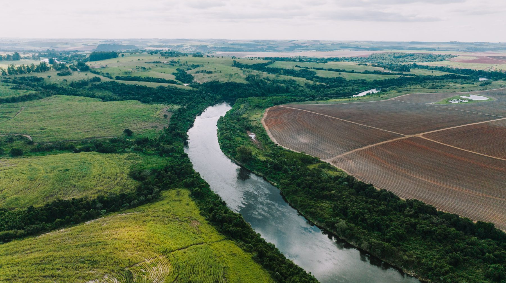

```{=html}
<a class="skip-link" href="#main">Skip to content</a>
<main id="main">
```

::: {.gw-page .gw-section .gw-section--tight}

```{=html}
<p class="gw-eyebrow">Chapter 2 · Multi-benefit Land Repurposing</p>
```

```{=html}
<div class="gw-chapter-head gw-chapter-head--mlrp">
```

```{=html}
<h1 class="gw-chapter-title">When land is repurposed, what is actually measured?</h1>
</div>
```

::: {.gw-chapter-intro}
::: {.gw-chapter-intro__body}

::: gw-prose
Multi-benefit land repurposing is meant to do several things at once: use less
water, and deliver habitat, community, and economic benefits alongside. Each of
those claims implies a measurement. The question this chapter asks is which of
them are actually made, when, and whether the answer enters the accounting
system at all.

The  programs differ less in what they fund than
in when they count: one measures repurposed parcels after implementation and
treats the result as enforceable, one estimates savings beforehand and never
checks back, one keeps its measurement outside the subbasin's accounting
entirely.
:::

:::

```{=html}
<figure class="chapter-photo chapter-photo--land">
  <div class="chapter-photo__frame">
    
  </div>
  <figcaption class="chapter-photo__cap">
    <span class="chapter-photo__cap-rule" aria-hidden="true"></span>
    <span class="chapter-photo__cap-label">Multi-benefit Land Repurposing</span>
  </figcaption>
</figure>
```

:::

:::

::: {.gw-band .gw-band--sage}
::: {.gw-wide}

```{=html}
<h2 class="gw-eyebrow">The Accounting Lifecycle</h2>

<figure class="gw-figure">
  <div class="gw-figure__body" style="background:var(--surface)">
    <p id="mlrp-chain-summary" class="gw-sr-summary">
      An eight-stage lifecycle: select or prioritise a parcel, fund the
      intervention, change the land use, measure water use, verify delivered
      savings, address allocation and leakage, measure co-benefits, and monitor
      durability over time. Across the reviewed programs the first three stages
      are well specified and the later stages thin out sharply.
    </p>
    <ol class="gw-chain" style="--accent: var(--mlrp)" role="img" aria-labelledby="mlrp-chain-summary">
      <li class="gw-chain__step">
        <span class="gw-chain__n">01</span>
        <span class="gw-chain__label">Select parcel</span>
        <span class="gw-chain__note">Scoring rubrics and siting criteria, with thresholds not always published.</span>
      </li>
      <li class="gw-chain__step">
        <span class="gw-chain__n">02</span>
        <span class="gw-chain__label">Fund intervention</span>
        <span class="gw-chain__note">All three run on Department of Conservation money. Who holds the grant differs.</span>
      </li>
      <li class="gw-chain__step">
        <span class="gw-chain__n">03</span>
        <span class="gw-chain__label">Change land use</span>
        <span class="gw-chain__note">Incentive agreement, per-acre payment, or outright purchase.</span>
      </li>
      <li class="gw-chain__step">
        <span class="gw-chain__n">04</span>
        <span class="gw-chain__label">Measure water use</span>
        <span class="gw-chain__note">Evapotranspiration in some form in all three — but at different times.</span>
      </li>
      <li class="gw-chain__step" style="border-top-color: var(--community)">
        <span class="gw-chain__n">05</span>
        <span class="gw-chain__label">Verify savings</span>
        <span class="gw-chain__note">The missing middle. Estimated before, measured after, or not measured at all.</span>
      </li>
      <li class="gw-chain__step" style="border-top-color: var(--community)">
        <span class="gw-chain__n">06</span>
        <span class="gw-chain__label">Allocation &amp; leakage</span>
        <span class="gw-chain__note">Whether the entitlement to pump moves, is suspended, or ceases to exist.</span>
      </li>
      <li class="gw-chain__step" style="border-top-color: var(--community)">
        <span class="gw-chain__n">07</span>
        <span class="gw-chain__label">Measure co-benefits</span>
        <span class="gw-chain__note">Named and sometimes scored or priced in every program. Measured as delivered outcomes in none.</span>
      </li>
      <li class="gw-chain__step">
        <span class="gw-chain__n">08</span>
        <span class="gw-chain__label">Monitor durability</span>
        <span class="gw-chain__note">Grant funding ends in 2027; monitoring obligations run longer.</span>
      </li>
    </ol>
  </div>
  <figcaption class="gw-caption">
    Stages 5 through 7 are where a repurposing program becomes an accounting
    instrument rather than a grant — exactly where the three programs are
    thinnest and most different from one another.
    <a href="findings.html?chapter=2.%20MLRP">See all  land repurposing findings &rarr;</a>
  </figcaption>
</figure>
```

:::
:::

::: {.gw-wide .gw-section}
```{=html}
<h2 class="gw-eyebrow">Key Findings</h2>
<div class="gw-pinned gw-pinned--keyfindings" data-pinned>
  <div class="gw-pinned__stage">
    <span class="gw-pinned__num" aria-hidden="true">01</span>
    <div class="gw-pinned__viewport">
      <ol class="gw-pinned__track">
        <li class="gw-pinned__step" data-num="01"><h3>Water-savings math built for irrigated fields overstates what fallowed land actually saves</h3><p>ET-minus-precipitation methods assume a parcel that stops irrigating also stops transpiring<sup><a href="#mlrp-ref-1">1</a></sup> — but fallowed and transitioning land keeps transpiring from residual soil moisture and volunteer vegetation, which skews the calculated saving above the real one. GSAs handle this inconsistently: some apply the method anyway and report the overestimate once it's measured<sup><a href="#mlrp-ref-2">2</a></sup>, others sidestep the problem by declining to track ET on repurposed parcels at all<sup><a href="#mlrp-ref-3">3</a></sup>. Neither resolves the underlying bias, and no bounding or correction method exists for either approach — or a future DWR standard — to adopt.</p></li>
        <li class="gw-pinned__step" data-num="02"><h3>Where the retired entitlement goes is a basin-scale exposure, not a program detail</h3><p>Resolving leakage — pumping that moves elsewhere after land is repurposed — is a precursor to claiming co-benefits<sup><a href="#mlrp-ref-4">4</a></sup>, yet there is no shared protocol for doing so. Some GSAs pay landowners and temporarily rescind their allocation while enrolled, which limits leakage<sup><a href="#mlrp-ref-5">5</a></sup>; others let landowners keep — and even transfer — the retained allocation to other parcels<sup><a href="#mlrp-ref-6">6</a></sup><sup>,</sup><sup><a href="#mlrp-ref-7">7</a></sup>. The latter design is more exposed: nothing stops the pumping it retires from resurfacing elsewhere in the basin.</p></li>
        <li class="gw-pinned__step" data-num="03"><h3>The literature has methods for co-benefits that no program has adopted</h3><p>Methods for quantifying land repurposing's co-benefits to ecosystems, disadvantaged communities, and water quality are well documented in the literature<sup><a href="#mlrp-ref-8">8</a></sup><sup>,</sup><sup><a href="#mlrp-ref-9">9</a></sup><sup>,</sup><sup><a href="#mlrp-ref-10">10</a></sup><sup>,</sup><sup><a href="#mlrp-ref-11">11</a></sup>, but GSAs don't measure them consistently: some score them arbitrarily at the application stage<sup><a href="#mlrp-ref-12">12</a></sup>, others price them into incentive rates without quantifying an outcome<sup><a href="#mlrp-ref-13">13</a></sup>, and one has identified a literature-based method without adopting it<sup><a href="#mlrp-ref-14">14</a></sup>. The literature-to-practice gap is the finding itself — rigorous methods exist, but a standardized approach local agencies can actually implement does not.</p></li>
        <li class="gw-pinned__step" data-num="04"><h3>Dust is named everywhere and measured nowhere</h3><p>There is universal awareness that dust is a hazard of land retirement, and that repurposing has the potential to mitigate it<sup><a href="#mlrp-ref-15">15</a></sup><sup>,</sup><sup><a href="#mlrp-ref-16">16</a></sup><sup>,</sup><sup><a href="#mlrp-ref-17">17</a></sup>. Across the three basins it's named but not measured<sup><a href="#mlrp-ref-18">18</a></sup>, treated as landowner liability<sup><a href="#mlrp-ref-19">19</a></sup>, named as an unmeasured co-benefit<sup><a href="#mlrp-ref-19">19</a></sup>, or not mentioned at all<sup><a href="#mlrp-ref-20">20</a></sup>. The literature itself is light on approaches that could fill this gap — recent work quantifies fallowed-land dust risk at the regional scale but stops short of a per-parcel or per-acre method tied to land repurposing<sup><a href="#mlrp-ref-21">21</a></sup><sup>,</sup><sup><a href="#mlrp-ref-22">22</a></sup><sup>,</sup><sup><a href="#mlrp-ref-23">23</a></sup>.</p></li>
        <li class="gw-pinned__step" data-num="05"><h3>[NEEDS COPY — key finding 5]</h3><p>Placeholder.</p></li>
      </ol>
    </div>
    <div class="gw-pinned__progress" role="group" aria-label="Jump to item">
      <button type="button" class="gw-pinned__dot" aria-label="Finding 1"></button>
      <button type="button" class="gw-pinned__dot" aria-label="Finding 2"></button>
      <button type="button" class="gw-pinned__dot" aria-label="Finding 3"></button>
      <button type="button" class="gw-pinned__dot" aria-label="Finding 4"></button>
      <button type="button" class="gw-pinned__dot" aria-label="Finding 5"></button>
    </div>
  </div>
</div>
<script type="module" src="assets/js/pinned-scene.js"></script>
```
:::

::: {.gw-wide .gw-section}

```{=html}
<h2 class="gw-eyebrow">Breakdown by Subbasin</h2>
```

::: gw-prose
## Where each subbasin's documents are clear, ambiguous, or silent

Every entry is a question the analysis put to that subbasin's document set,
reporting what the documents actually said — as a coded finding type, never as a
score. Selecting an entry opens the evidence behind it.
:::

```{=html}
<div class="gw-breakdown gw-loading" id="mlrp-breakdown" data-chapter="2. MLRP">Loading the subbasin breakdown&hellip;</div>
<script type="module" src="assets/js/breakdown.js"></script>
```

::: gw-caption
The document sets are not equally complete. Several Salinas Valley absences are
gaps in document availability; several East Turlock absences reflect programs
that have not yet produced results. Cells in the same row are not equally
weighted evidence.
:::

```{=html}
<h3 class="gw-eyebrow" style="margin-top:3rem">All three subbasins at a glance</h3>
<div id="mlrp-matrix" class="gw-loading">Loading the comparison&hellip;</div>
```

:::

::: {.gw-band .gw-band--deep}
::: {.gw-page}

```{=html}
<h2 class="gw-eyebrow" style="color:var(--mlrp-light)">Connection to Accounting</h2>
```

::: gw-prose
### Implementing findings into the Groundwater Accounting Platform

Changing the land use and changing the entitlement to pump are separate
decisions, and a program can do the first without the second. Across the three
programs the entitlement variously stays with the landowner and can move, is
suspended for the paid term with no transfer mechanism in existence, or ceases
to exist because the land was bought outright.

None of the three publishes reporting on the allocation status of repurposed
parcels — so none could detect movement even where movement is permitted.
:::

```{=html}
<!-- PLACEHOLDER treatment. Richer options to workshop: a toggle between what a
     platform could credit today vs. what needs a new measurement; a per-stage
     "what the platform would need to add" list linking into filtered findings. -->
<div class="gw-contrast">
  <div class="gw-contrast__card gw-contrast__card--now">
    <h3>What a platform could credit now</h3>
    <p>An estimated or measured evapotranspiration reduction on a repurposed
    parcel, where the program produces one.</p>
  </div>
  <div class="gw-contrast__card gw-contrast__card--gap">
    <h3>What it cannot yet see</h3>
    <p>Whether the entitlement moved, whether a co-benefit was delivered, and
    whether the saving held after the grant closed.</p>
  </div>
</div>
<p style="margin-top:1.5rem">
  <a class="gw-btn" href="findings.html?chapter=2.%20MLRP&amp;section=2.3%20Allocation%20and%20Leakage">Evidence on allocation and leakage &rarr;</a>
</p>
```

:::
:::

::: {.gw-page .gw-section}
```{=html}
<h2 class="gw-eyebrow">Beyond</h2>

<div class="gw-draft-banner">
  <svg viewBox="0 0 24 24" fill="none" stroke="currentColor" stroke-width="1.8" stroke-linecap="round" stroke-linejoin="round" aria-hidden="true"><path d="M10.3 3.9 2.4 18a2 2 0 0 0 1.7 3h15.8a2 2 0 0 0 1.7-3L13.7 3.9a2 2 0 0 0-3.4 0Z"/><path d="M12 9v4M12 17h.01"/></svg>
  <span><strong>Draft — not yet published.</strong> No GSA board-meeting evidence
  has been reviewed. This section is scaffolding for a future WaterOne.ai
  evidence stream; nothing here implies any meeting has been analyzed.</span>
</div>
```

::: gw-prose
Explore how other subbasins are thinking about these topics, from information
gathered from GSA board meetings via the WaterOne.ai platform.
:::

```{=html}
<div class="gw-locator gw-loading" id="mlrp-beyond" data-beyond="mlrp">Loading&hellip;</div>
<script type="module" src="assets/js/beyond-map.js"></script>
```
:::

::: {.gw-page .gw-section}
```{=html}
<h2 class="gw-eyebrow">Further Exploration</h2>
```

::: {.gw-prose .gw-further__lead}
Open questions this chapter raises and does not answer. Select one to see why it
matters.
:::

```{=html}
<!-- PLACEHOLDER presentation. Ideas to workshop: a word/phrase cloud sized by
     how often each question surfaced in the coding; a constellation the reader
     connects; a "pick a thread" chooser routing into a filtered findings view. -->
<div class="gw-further gw-loading" id="mlrp-further" data-further="mlrp">Loading&hellip;</div>
<script type="module" src="assets/js/further.js"></script>
```
:::

::: {.gw-page .gw-section .gw-section--tight}

```{=html}
<h2 class="gw-eyebrow">Geography</h2>
```

```{=html}
<div class="gw-map gw-map--land">
  <div class="gw-map__frame">
    <!-- MAP_MLRP_EMBED — optional second map. Replace this block with the
         public ArcGIS embed when the data support a meaningful comparison. -->
    <div class="gw-map__pending">
      <p><span class="gw-placeholder-token">MAP_MLRP_EMBED</span></p>
      <p>An optional land repurposing map is reserved for this container.</p>
    </div>
  </div>
  <div class="gw-map__cap">
    <p><strong>A limitation, not an omission.</strong> Project-location data
    are documented inconsistently across the three subbasins. Forcing them onto
    one map would imply a spatial comparability the source documents do not
    support, so this map will only be published if the data can carry it.</p>
  </div>
</div>
```

::: gw-caption
The remaining narrative sections — financing, ET product choice, co-benefit
quantification, dust, post-grant funding — are still being written. The coded
evidence is already searchable in the
[Findings Explorer](findings.qmd?chapter=2.%20MLRP).
:::

:::

::: {.gw-page}
```{=html}
<details class="gw-refs" style="margin-top:1rem">
  <summary style="cursor:pointer;color:var(--ink-muted)">Notes and sources for the key findings above</summary>
  <ol style="margin-top:.75rem;padding-left:1.25rem">
    <li id="mlrp-ref-1">Zipper et al. 2024</li>
    <li id="mlrp-ref-2">Merced Annual Report &sect;3.3, p. 3-9 [PDF 54]</li>
    <li id="mlrp-ref-3">Turlock Rules and Regulations Phase 2, &sect;4.04, pp. 14&ndash;15 [PDF 14&ndash;15]</li>
    <li id="mlrp-ref-4">Bryant et al., 2020</li>
    <li id="mlrp-ref-5">Turlock East Rules and Regulations Phase 2, Article V, p. 25 [PDF 29]</li>
    <li id="mlrp-ref-6">Merced MLRP Development Project Application, p. 6 [PDF 14]</li>
    <li id="mlrp-ref-7">Merced GSP &sect;6.2.3, p. 6-11 [PDF 472]</li>
    <li id="mlrp-ref-8">Howard et al., 2013</li>
    <li id="mlrp-ref-9">Rohde et al., 2024</li>
    <li id="mlrp-ref-10">Pauloo et al., 2020</li>
    <li id="mlrp-ref-11">Fernandez-Bou et al. 2022</li>
    <li id="mlrp-ref-12">Merced MLRP Development Project Application, &ldquo;Ecological&rdquo; scoring category, p. 14 [PDF 22]</li>
    <li id="mlrp-ref-13">Turlock East Incentive Payment Procedures, Table 1, pp. 6&ndash;7 [PDF 6&ndash;7]</li>
    <li id="mlrp-ref-14">Salinas Valley GDE Identification and Mapping report, PDF p. 19 (threshold method); Periodic Evaluation &sect;2.7.2, PDF p. 79 (confirms not adopted)</li>
    <li id="mlrp-ref-15">Merced MLRP Development Project RFP, Background, pp. 2&ndash;3 [PDF 3&ndash;4] &mdash; &ldquo;When improperly managed, idle fields can emit dust and worsen air quality&hellip; Multibenefit Land Repurposing is a beneficial alternative that aims to reduce potential negative impacts.&rdquo;</li>
    <li id="mlrp-ref-16">East Turlock Implementation Standards, Rewilding, Requirements/General, p. 2 [PDF 2]</li>
    <li id="mlrp-ref-17">Fern&aacute;ndez-Bou et al., 2025</li>
    <li id="mlrp-ref-18">Merced MLRP Development Project RFP &mdash; dust/air quality appears as an unmeasured checkbox item in the community benefit scoring criteria (in addition to note 15); no particulate metric, emissions factor, monitoring requirement, or baseline/threshold appears in any Merced program document.</li>
    <li id="mlrp-ref-19">East Turlock Implementation Standards &mdash; Rewilding, Requirements/General, p. 2 [PDF 2] (landowner liability for dust harm; perimeter hedgerow as optional wind buffer); Vegetated Cover standard lists &ldquo;Decreased particulate and other air emissions&rdquo; among its objectives with no measurement method attached.</li>
    <li id="mlrp-ref-20">Salinas Valley 2020 GSP, Amendment 1, Periodic Evaluation, Response to DWR, Ecosystem Report, and WY 2025 Annual Report &mdash; word-boundary searches for &ldquo;dust,&rdquo; &ldquo;PM10,&rdquo; &ldquo;particulate,&rdquo; and &ldquo;air quality&rdquo; return zero hits across all six documents.</li>
    <li id="mlrp-ref-21">Adebiyi et al., 2025</li>
    <li id="mlrp-ref-22">Ayres et al., 2022</li>
    <li id="mlrp-ref-23">Becker et al., 2022</li>
  </ol>
</details>
```
:::

```{=html}
<script type="module" src="assets/js/figures.js"></script>
</main>
```
